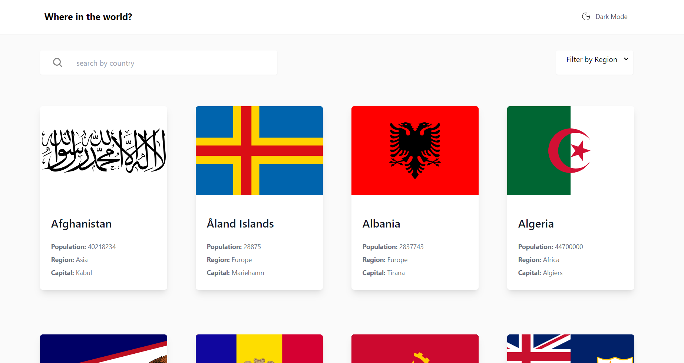
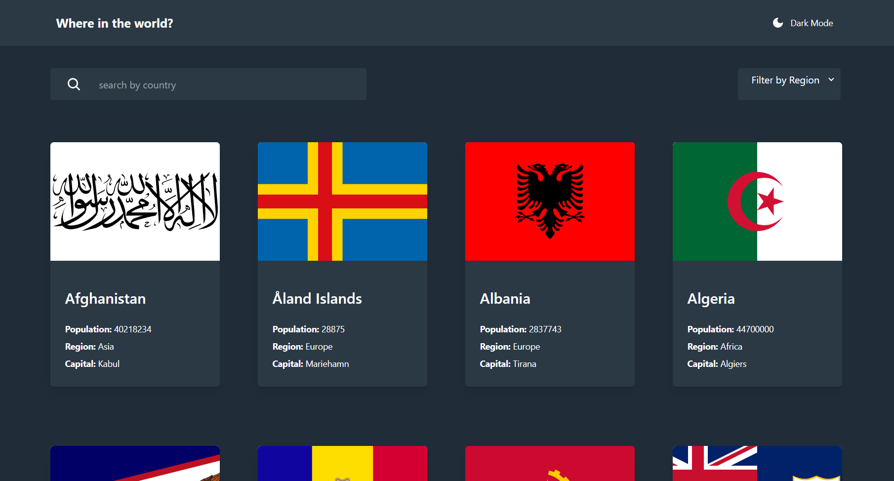

# Frontend Mentor - REST Countries API with color theme switcher challenge solution

This is a solution to the [REST Countries API with color theme switcher challenge on Frontend Mentor](https://www.frontendmentor.io/challenges/rest-countries-api-with-color-theme-switcher-5cacc469fec04111f7b848ca). Frontend Mentor challenges help you improve your coding skills by building realistic projects.

## Table of contents

-   [Overview](#overview)
    -   [Screenshot](#screenshot)
    -   [Links](#links)
-   [My process](#my-process)
    -   [Built with](#built-with)
    -   [What I learned](#what-i-learned)
    -   [Continued development](#continued-development)
    -   [Useful resources](#useful-resources)
-   [Author](#author)
-   [Acknowledgments](#acknowledgments)

**Note: Delete this note and update the table of contents based on what sections you keep.**

## Overview

The challenge is to build out this QR code component and get it looking as close to the design as possible.

### Screenshot

Light Mode:

Dark Mode:

### Links

-   Solution URL: [Git Repository](https://github.com/murytarlah/rest-ccountries)
-   Live Site URL: [Live Preview](https://rest-ccountries.vercel.app/)

## My process

I started out by bootstrapping the project with `create-react-app` and then I created the necessary components and styles for the project. I then imlemented the logic for the theme switcher and the search functionality. I then added the data from the API and styled the components to match the design.

### Built with

-   React
-   CSS
-   Grid
-   Tailwind CSS

**Note: These are just examples. Delete this note and replace the list above with your own choices**

### What I learned

I got to learn how to use the `fetch` API to get data from an external API and how to use the `useState` hook to manage state in a functional component. I also got to learn how to use the `useEffect` hook to perform side effects in a functional component.

### Continued development

I plan to continue learning more about React and how to use it to build more complex applications. I also plan to write unit tests and integration tests for this very soon.

### Useful resources

-   [`React`](http://react.dev/) - This is a UI library for building user interfaces. It is very easy to learn and use.
-   [`React Router`](https://reactrouter.com/) - This is a routing library for React. It is very easy to use and has a lot of features.
-   [`Tailwind`](https://tailwindcss.com/) - This is a utility-first CSS framework. It is very easy to use and has a lot of features. It helped me in styling my components and making my styling time much faster.

## Author

-   Website - sadly no personal website yet, but you can check out my linked in profile [here](https://www.linkedin.com/in/murytarlah)
-   Frontend Mentor - [@murytarlah](https://www.frontendmentor.io/profile/murytarlah)
-   Twitter - [@murytarlah](https://www.twitter.com/murytarlah)
